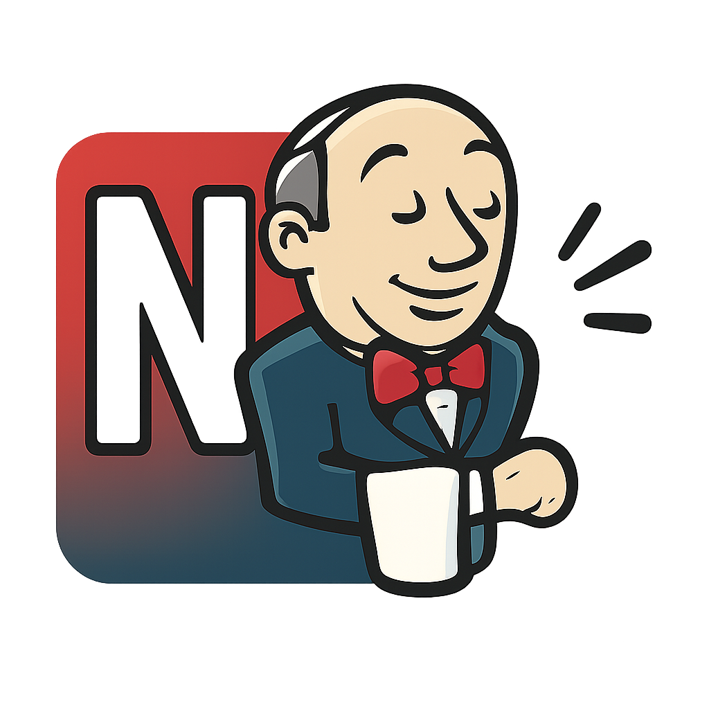

  

# jenkins-nudge

jenkins-nudge is a chrome extension that lets you receive instant desktop notifications when your Jenkins jobs finish, right from the Jenkins web UI. it adds a 'notify on job completion' button next to the 'edit description' button on job and console pages, so you never miss a build result.

## features
- one-click notifications for any jenkins job
- works on both job summary and console output pages
- notification includes job name, build number, and status
- optional sound alert for notifications
- lightweight and easy to use

## installation
1. clone or download this repository.
2. go to `chrome://extensions` in your browser.
3. enable 'developer mode' (top right).
4. click 'load unpacked' and select this project folder.

## usage
- visit any jenkins job page (e.g. `/job/your-job/123/`).
- click the 'notify on job completion' button (to the left of 'edit description').
- you'll get a desktop notification when the job finishes (success or failure).
- enable or disable sound in the extension popup.

## permissions
- notifications: to show desktop alerts
- storage: to save your sound preference
- activeTab, scripting: to inject the button into jenkins pages

## why jenkins-nudge?
there are many jenkins notifiers, but this one is:
- always visible where you need it (right in the ui)
- simple, no server setup or api tokens
- open source and privacy-friendly

---

made with ❤️ for devs who want to stay in the loop, not in the dark.
